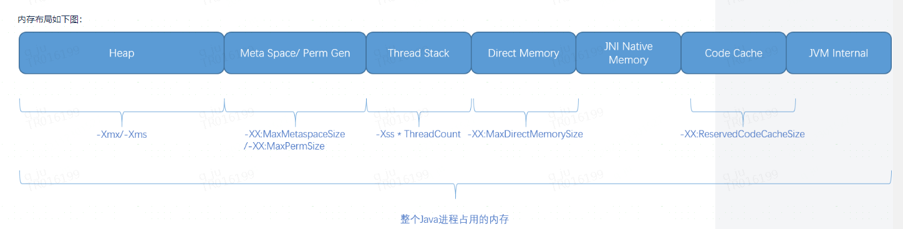

## 1. JVM运行时的内存消耗
1. heap
2. thread stack
3. direct memory
4. JNI Native Memory
5. Meta Space
6. Code cache
7. JVM自身使用的内存，存储一些JVM内部的数据结构（如，GC用到的数据结构）

## 2. 分代内存管理

1. Young 年轻代
   1. Eden
   2. Survivor
      1. From
      2. To
2. Old 老年代
在survivor存活超过一定次数的会被转移到old区，也有一部分对象直接在老年代分配。老年代用完会发生Full GC(Major GC),此时年轻代和老年代都会进行垃圾回收。

## stop the world和current对比
1. STW进程内所有应用线程停止运行，如果发生时某一个线程正在处理请求，则这个线程只能在STW结束后才会继续执行。
2. Concurrent
   1. Concurrent GC某些阶段也会需要STW，如CMS.
   2. 因为是GC线程和应用线程同时运行，所以需要关注以下问题：
      1. cpu使用，GC线程会消耗CPU导致CPU变高，如果CPU不足可能会导致应用响应时间变慢。
      2. 因为GC发生时应用线程仍在运行，同时也会产生内存分配，所以需要提前进行Concurrent GC，保证heap内可用内存足以支撑正在同时运行的应用线程对
         内存分配的需求。否则，Concurrent GC会失败，然后重新进入STW的GC

